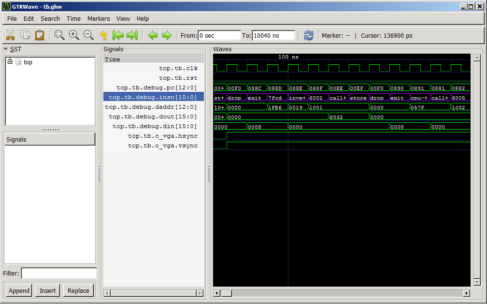
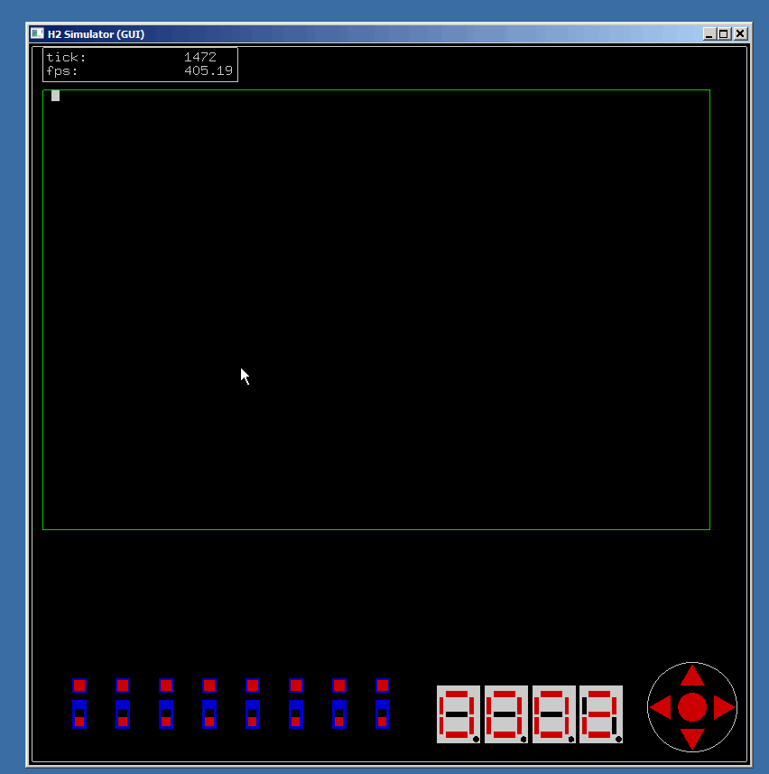

# Forth computing system

Author:

* Richard James Howe.

Copyright:

* Copyright 2013-2017 Richard James Howe.

License:

* MIT/LGPL

Email:

* howe.r.j.89@gmail.com

# Introduction

This project implements a small stack computer tailored to executing Forth
based on the [J1][] CPU. The processor has been rewritten in [VHDL][] from
[Verilog][], and extended slightly. The project is a work in progress and is
needs a lot of work before become usable. 

The goals of the project are as follows:

* Create a working version of [J1][] processor (called the H2).
* Make a working toolchain for the processor.
* Create a [FORTH][] for the processor which can take its input either from a
  [UART][] or a USB keyboard and a [VGA][] adapter.

The H2 processor, like the [J1][], is a stack based processor that executes an
instruction set especially suited for [FORTH][].

The current target is the [Nexys3][] board, with a [Xilinx][] Spartan-6 XC6LX16-CS324 
[FPGA][], new boards will be targeted in the future as this board is reaching it's 
end of life. The [VHDL][] is written in a generic way, with hardware components 
being inferred instead of explicitly instantiated, this should make the code 
fairly portable, although the interfaces to the [Nexys3][] board components are
specific to the peripherals on that board.

# License

The licenses used by the project are mixed and are on a per file basis. For my
code I use the [MIT][] license - so feel free to use it as you wish. The other
licenses used are the [LGPL][], they are confined to single modules so could be
removed if you have some aversion to [LGPL][] code.

# Target Board

The only target board available at the moment is the [Nexys3][], this should
change in the future as the board is currently at it's End Of Life. The next
boards I am looking to support are it's successor, the Nexys 4, and the myStorm
BlackIce (<https://mystorm.uk/>). The myStorm board uses a completely open
source toolchain for synthesis, place and route and bit file generation.

# Build requirements

The build has been tested under [Debian][] [Linux][], version 8.

You will require:

* [GCC][], or a suitable [C][] compiler capable of compiling [C99][]
* [Make][]
* [Xilinx ISE][] version 14.7
* [GHDL][]
* [GTKWave][]
* [tcl][] version 8.6
* Digilent Adept2 runtime and Digilent Adept2 utilities available at
  <http://store.digilentinc.com/digilent-adept-2-download-only/>
* [freeglut][] (for the GUI simulator only)

[Xilinx ISE][] can (or could be) downloaded for free, but requires
registration. ISE needs to be on your path:

	PATH=$PATH:/opt/Xilinx/14.7/ISE_DS/ISE/bin/lin64;
	PATH=$PATH:/opt/Xilinx/14.7/ISE_DS/ISE/lib/lin64;

# Building and Running

To make the [C][] based toolchain:

	make h2

To make a bit file that can be flashed to the target board:

	make simulation synthesis implementation bitfile

To upload the bitfile to the target board:

	make upload

To view the wave form generated by "make simulation":

	make viewer

The [C][] based CLI simulator can be invoked with:

	make run

Which will assemble the H2 Forth source file [h2.fth][], and run the assembled
object file under the H2 simulator with the debugger activated. A graphical
simulator can be run with:

	make grun

Which requires [freeglut][] as well as a [C][] compiler.

# Manual

The H2 processor and associated peripherals are subject to change, so the code
is the definitive source what instructions are available, the register map, and
how the peripherals behave.

There are a few modifications to the [J1][] CPU which include:

* New instructions
* A CPU hold line which keeps the processor in the same state so long as it is
high.
* Interrupt Service Routines have been added.

The Interrupt Service Routines (ISR) have not been throughly tested and will be
subject to the most change.

### H2 CPU

The H2 CPU behaves very similarly to the [J1][] CPU, and the [J1 PDF][] can be
read in order to better understand this processor. The processor is 16-bit with
instructions taking a single clock cycle. Most of the primitive Forth words can
also be executed in a single cycle as well, one notable exception is store ("!"),
which is split into two instructions.

The CPU has the following state within it:

* A 32 deep return stack
* A 33 deep variable stack
* A program counter
* An interrupt enable and interrupt request bit
* An interrupt address register

Loads and stores into the block RAM that holds the H2 program discard the
lowest bit, every other memory operation uses the lower bit (such as jumps
and loads and stores to Input/Output peripherals). This is so applications can
use the lowest bit for character operations when accessing the program RAM. 

The instruction set is decoded in the following manner:

	+---------------------------------------------------------------+
	| F | E | D | C | B | A | 9 | 8 | 7 | 6 | 5 | 4 | 3 | 2 | 1 | 0 |
	+---------------------------------------------------------------+
	| 1 |                    LITERAL VALUE                          |
	+---------------------------------------------------------------+
	| 0 | 0 | 0 |            BRANCH TARGET ADDRESS                  |
	+---------------------------------------------------------------+
	| 0 | 0 | 1 |            CONDITIONAL BRANCH TARGET ADDRESS      |
	+---------------------------------------------------------------+
	| 0 | 1 | 0 |            CALL TARGET ADDRESS                    |
	+---------------------------------------------------------------+
	| 0 | 1 | 1 |   ALU OPERATION   |T2N|T2R|N2A|R2P| RSTACK| DSTACK|
	+---------------------------------------------------------------+
	| F | E | D | C | B | A | 9 | 8 | 7 | 6 | 5 | 4 | 3 | 2 | 1 | 0 |
	+---------------------------------------------------------------+

	T   : Top of data stack
	N   : Next on data stack
	PC  : Program Counter

	LITERAL VALUES : push a value onto the data stack
	CONDITIONAL    : BRANCHS pop and test the T
	CALLS          : PC+1 onto the return stack

	T2N : Move T to N
	T2R : Move T to top of return stack
	N2A : STORE T to memory location addressed by N
	R2P : Move top of return stack to PC

	RSTACK and DSTACK are signed values (twos compliment) that are
	the stack delta (the amount to increment or decrement the stack
	by for their respective stacks: return and data)

#### ALU operations

All ALU operations replace T:

	+-------+----------------+-----------------------+
	| Value |   Operation    |     Description       |
	+-------+----------------+-----------------------+
	|   0   |       T        |  Top of Stack         |
	|   1   |       N        |  Copy T to N          |
	|   2   |     T + N      |  Addition             |
	|   3   |     T & N      |  Bitwise AND          |
	|   4   |     T | N      |  Bitwise OR           |
	|   5   |     T ^ N      |  Bitwise XOR          |
	|   6   |      ~T        |  Bitwise Inversion    |
	|   7   |     T = N      |  Equality test        |
	|   8   |     N < T      |  Signed comparison    |
	|   9   |     N >> T     |  Logical Right Shift  |
	|  10   |     T - 1      |  Decrement            |
	|  11   |       R        |  Top of return stack  |
	|  12   |      [T]       |  Load from address    |
	|  13   |     N << T     |  Logical Left Shift   |
	|  14   |     depth      |  Depth of stack       |
	|  15   |     N u< T     |  Unsigned comparison  |
	|  16   | set interrupts |  Enable interrupts    |
	|  17   | interrupts on? |  Are interrupts on?   |
	|  18   |     rdepth     |  Depth of return stk  |
	|  19   |      0=        |  T == 0?              |
	|  20   |     CPU ID     |  CPU Identifier       |
	+-------+----------------+-----------------------+

### Peripherals and registers

Registers marked prefixed with an 'o' are output registers, those with an 'i'
prefix are input registers. Registers are divided into an input and output
section of registers and the addresses of the input and output registers do not
correspond to each other in all cases. Unlike for RAM reads, the I/O registers
are indexed by word aligned addresses, without the lowest bit being discarded
(this should be fixed at a later date).

The following peripherals have been implemented in the [VHDL][] SoC to
interface with devices on the [Nexys3][] board:

* [VGA][] output device, text mode only, 80 by 40 characters from
  <http://www.javiervalcarce.eu/html/vhdl-vga80x40-en.html>
* Timer 
* [UART][] (Rx/Tx) with a [FIFO][]
from <https://github.com/pabennett/uart>
* [PS/2][] Keyboard
from <https://eewiki.net/pages/viewpage.action?pageId=28279002>
* [LED][] next to a bank of switches
* An [8 Segment LED Display][] driver (a 7 segment display with a decimal point)

The SoC also features a limited set of interrupts that can be enabled or
disabled.

	+---------------------------------------------------------+
	|                   Input Registers                       |
	+-------------+---------+---------------------------------+
	| Register    | Address | Description                     |
	+-------------+---------+---------------------------------+
	| iUart       | 0x6000  | UART register                   |
	| iSwitches   | 0x6001  | Buttons and switches            |
	| iTimerCtrl  | 0x6002  | Timer control Register          |
	| iTimerDin   | 0x6003  | Current Timer Value             |
	| iVgaTxtDout | 0x6004  | Contents of address oVgaTxtAddr |
	| iPs2        | 0x6005  | PS2 Keyboard Register           |
	| iLfsr       | 0x6006  | LFSR Seed                       |
	+-------------+---------+---------------------------------+

	+---------------------------------------------------------+
	|                   Output Registers                      |
	+-------------+---------+---------------------------------+
	| Register    | Address | Description                     |
	+-------------+---------+---------------------------------+
	| oUart       | 0x6000  | UART register                   |
	| oLeds       | 0x6001  | LED outputs                     |
	| oTimerCtrl  | 0x6002  | Timer control                   |
	| oVgaCursor  | 0x6003  | VGA Cursor X/Y cursor position  |
	| oVgaCtrl    | 0x6004  | VGA control registers           |
	| o8SegLED    | 0x6005  | 4 x LED 8 Segment display 0     |
	| oIrcMask    | 0x6006  | CPU Interrupt Mask              |
	| oLfsr       | 0x6007  | LFSR Value                      |
	| VGA Memory  | 0xE000  | VGA memory                      |
	|             |    -    |                                 |
	|             | 0xFFFF  |                                 |
	+-------------+---------+---------------------------------+

The following description of the registers should be read in order and describe
how the peripherals work as well.

#### oUart

A UART with a fixed baud rate and format (115200, 8 bits, 1 stop bit) is
present on the SoC. The UART has a FIFO of depth 8 on both the RX and TX
channels. The control of the UART is split across oUart and iUart. 

To write a value to the UART assert TXWE along with putting the data in TXDO.
The FIFO state can be analyzed by looking at the iUart register.

To read a value from the UART: iUart can be checked to see if data is present
in the FIFO, if it is assert RXRE in the oUart register, on the next clock
cycle the data will be present in the iUart register.

The baud rate of the UART can be changed by rebuilding the VHDL project, bit
length, parity bits and stop bits can only be changed with modifications to
[uart.vhd][]

	+-------------------------------------------------------------------------------+
	| 15 | 14 | 13 | 12 | 11 | 10 |  9 |  8 |  7 |  6 |  5 |  4 |  3 |  2 |  1 |  0 |
	+-------------------------------------------------------------------------------+
	|  X |  X |TXWE|  X |  X |RXRE|  X |  X |               TXDO                    |
	+-------------------------------------------------------------------------------+

	TXWE: UART RT Write Enable
	RXRE: UART RX Read Enable
	TXDO: Uart TX Data Output

#### oLeds

On the [Nexys3][] board there is a bank of LEDs that are situated next to the
switches, these LEDs can be turned on (1) or off (0) by writing to LEDO. Each
LED here corresponds to the switch it is next to.

	+-------------------------------------------------------------------------------+
	| 15 | 14 | 13 | 12 | 11 | 10 |  9 |  8 |  7 |  6 |  5 |  4 |  3 |  2 |  1 |  0 |
	+-------------------------------------------------------------------------------+
	|  X |  X |  X |  X |  X |  X |  X |  X |              LEDO                     |
	+-------------------------------------------------------------------------------+

	LEDO: LED Output

#### oTimerCtrl

The timer is controllable by the oTimerCtrl register, it is a 13-bit timer
running at 100MHz, it can optionally generate interrupts and the current timers
internal count can be read back in with the iTimerDin register.

The timer counts once the TE bit is asserted, once the timer reaches TCMP value
it wraps around and can optionally generate an interrupt by asserting INTE.
This also toggles the Q and NQ lines that come out of the timer and are routed
to pins on the board (see the constraints file [top.ucf][] for the pins).

The timer can be reset by writing to RST.

	+-------------------------------------------------------------------------------+
	| 15 | 14 | 13 | 12 | 11 | 10 |  9 |  8 |  7 |  6 |  5 |  4 |  3 |  2 |  1 |  0 |
	+-------------------------------------------------------------------------------+
	| TE | RST|INTE|                      TCMP                                      |
	+-------------------------------------------------------------------------------+

	TE:   Timer Enable
	RST:  Timer Reset
	INTE: Interrupt Enable
	TCMP: Timer Compare Value

#### oVgaCursor

The VGA Text peripheral has a cursor, the cursor position can be changed with
this register.

	+-------------------------------------------------------------------------------+
	| 15 | 14 | 13 | 12 | 11 | 10 |  9 |  8 |  7 |  6 |  5 |  4 |  3 |  2 |  1 |  0 |
	+-------------------------------------------------------------------------------+
	|  X |  X |          POSY               |  X |            POSX                  |
	+-------------------------------------------------------------------------------+

	POSY: VGA Text Cursor Position Y
	POSX: VGA Text Cursor Position X

#### oVgaCtrl

The VGA control register contains bits that affect the behavior of the VGA Text
display. The VGA peripheral is a text only display, each location in video ram
gets written out to the display as a character. The display is monochrome, but
which color is used can be selected with the RED (for red), GRN (for green) and
BLU (for blue) bits in the oVgaCtrl register.

The CEN bit enables the cursor, and the BLK bit makes the cursor blink. The MOD
bit changes the cursors shape.

	+-------------------------------------------------------------------------------+
	| 15 | 14 | 13 | 12 | 11 | 10 |  9 |  8 |  7 |  6 |  5 |  4 |  3 |  2 |  1 |  0 |
	+-------------------------------------------------------------------------------+
	|  X |  X |  X |  X |  X |  X |  X |  X |  X | VEN| CEN| BLK| MOD| RED| GRN| BLU|
	+-------------------------------------------------------------------------------+

	VEN: VGA Enable
	CEN: Cursor Enable
	BLK: Cursor Blink
	MOD: Cursor Mode
	RED: Red Enable
	GRN: Green Enable
	BLU: Blue Enable

#### o8SegLED

On the [Nexys3][] board there is a bank of 7 segment displays, with a dot
(8-segment really), which can be used for numeric output. The LED segments
cannot be directly addressed. Instead the value stored in L8SD is mapped
to a hexadecimal display value (or a BCD value, but this requires regeneration 
of the SoC and modification of a generic in the VHDL).

The value '0' corresponds to a zero displayed on the LED segment, '15' to an
'F', etcetera.

There are 4 displays in a row.

	+-------------------------------------------------------------------------------+
	| 15 | 14 | 13 | 12 | 11 | 10 |  9 |  8 |  7 |  6 |  5 |  4 |  3 |  2 |  1 |  0 |
	+-------------------------------------------------------------------------------+
	|      L8SD0        |       L8SD1       |       L8SD2       |       L8SD3       |
	+-------------------------------------------------------------------------------+

	L8SD0: LED 8 Segment Display (leftmost display)
	L8SD1: LED 8 Segment Display
	L8SD2: LED 8 Segment Display
	L8SD3: LED 8 Segment Display (right most display)

#### oIrcMask

The H2 core has a mechanism for interrupts, interrupts have to be enabled or
disabled with an instruction. Each interrupt can be masked off with a bit in
IMSK to enable that specific interrupt. A '1' in a bit of IMSK enables that
specific interrupt, which will be delivered to the CPU if interrupts are
enabled within it.

	+-------------------------------------------------------------------------------+
	| 15 | 14 | 13 | 12 | 11 | 10 |  9 |  8 |  7 |  6 |  5 |  4 |  3 |  2 |  1 |  0 |
	+-------------------------------------------------------------------------------+
	|  X |  X |  X |  X |  X |  X |  X |  X |                 IMSK                  |
	+-------------------------------------------------------------------------------+

	IMSK: Interrupt Mask

#### oLfsr

This register contains the interface the output of the Linear Feedback Shift
Register ([LFSR][]). It needs an initial non-zero seed value before it will start 
counting, which can be supplied with iLfsr. 

	+-------------------------------------------------------------------------------+
	| 15 | 14 | 13 | 12 | 11 | 10 |  9 |  8 |  7 |  6 |  5 |  4 |  3 |  2 |  1 |  0 |
	+-------------------------------------------------------------------------------+
	|                               LFSR                                            |
	+-------------------------------------------------------------------------------+

	LFSR: Current Linear Feedback Shift Register Value

#### VGA Memory

The VGA memory occupies the range 0xE000 to 0xFFFF, it can be written to (but
not read from) like normal memory, except like all I/O registers the lowest bit
is used for addressing, whereas in normal memory it is not. The lowest byte is
display on the screen out of the 16-bit value. 

The value stored is treated as a [ISO 8859-1 (Latin-1)][] character (which is
an extended [ASCII][] character set.

#### iUart

The iUart register works in conjunction with the oUart register. The status of
the FIFO that buffers both transmission and reception of bytes is available in
the iUart register, as well as any received bytes.

	+-------------------------------------------------------------------------------+
	| 15 | 14 | 13 | 12 | 11 | 10 |  9 |  8 |  7 |  6 |  5 |  4 |  3 |  2 |  1 |  0 |
	+-------------------------------------------------------------------------------+
	|  X |  X |  X |TFFL|TFEM|  X |RFFL|RFEM|                RXDI                   |
	+-------------------------------------------------------------------------------+

	TFFL: UART TX FIFO Full
	TFEM: UART TX FIFO Empty
	RFFL: UART RX FIFO Full
	RFEM: UART RX FIFO Empty
	RXDI: UART RX Data Input

#### iSwitches

iSwitches contains input lines from multiple sources. The RX bit corresponds to
the UART input line, it is the raw input without any processing. The buttons
(BUP, BDWN, BLFT, BRGH, and BCNT) correspond to a [D-Pad][] on the [Nexys3][]
board. The switches (TSWI) are the ones mentioned in oLeds, each have an LED
next to them. 

The switches and the buttons are already debounced in hardware so they do not
have to be further processed once read in from these registers.

	+-------------------------------------------------------------------------------+
	| 15 | 14 | 13 | 12 | 11 | 10 |  9 |  8 |  7 |  6 |  5 |  4 |  3 |  2 |  1 |  0 |
	+-------------------------------------------------------------------------------+
	|  X |  X | RX | BUP|BDWN|BLFT|BRGH|BCNT|               TSWI                    |
	+-------------------------------------------------------------------------------+

	RX:   UART RX Line
	BUP:  Button Up
	BDWN: Button Down
	BLFT: Button Left
	BRGH: Button Right
	BCNT: Button Center
	TSWI: Two Position Switches

#### iTimerCtrl

This register contains the contents stored in oTimerCtrl.

	+-------------------------------------------------------------------------------+
	| 15 | 14 | 13 | 12 | 11 | 10 |  9 |  8 |  7 |  6 |  5 |  4 |  3 |  2 |  1 |  0 |
	+-------------------------------------------------------------------------------+
	| TE | RST|INTE|                      TCMP                                      |
	+-------------------------------------------------------------------------------+

	TE:   Timer Enable
	RST:  Timer Reset
	INTE: Interrupt Enable
	TCMP: Timer Compare Value

#### iTimerDin

This register contains the current value of the timers counter. 

	+-------------------------------------------------------------------------------+
	| 15 | 14 | 13 | 12 | 11 | 10 |  9 |  8 |  7 |  6 |  5 |  4 |  3 |  2 |  1 |  0 |
	+-------------------------------------------------------------------------------+
	|  X |  X |  X |                       TCNT                                     |
	+-------------------------------------------------------------------------------+

	TCNT: Timer Counter Value

#### iVgaTxtDout

This register contains the value of the video memory index by oVgaTxtAddr. The
mechanism for reading from VGA ram does not work correctly at the moment.

	+-------------------------------------------------------------------------------+
	| 15 | 14 | 13 | 12 | 11 | 10 |  9 |  8 |  7 |  6 |  5 |  4 |  3 |  2 |  1 |  0 |
	+-------------------------------------------------------------------------------+
	|                                     VRDO                                      |
	+-------------------------------------------------------------------------------+

	VRDO: VGA RAM Data Output

#### iPs2

This register contains the interface to the PS/2 keyboard. If PS2N is set then
an [ASCII][] character is present in ACHR. Both PS2N and ACHR will be cleared.

	+-------------------------------------------------------------------------------+
	| 15 | 14 | 13 | 12 | 11 | 10 |  9 |  8 |  7 |  6 |  5 |  4 |  3 |  2 |  1 |  0 |
	+-------------------------------------------------------------------------------+
	|  X |  X |  X |  X |  X |  X |  X |PS2N|  X |              ACHR                |
	+-------------------------------------------------------------------------------+

	PS2N: New character available on PS2 Keyboard
	ACHR: ASCII Character

#### iLfsr

This register contains the interface to the input of the Linear Feedback Shift
Register ([LFSR][]). It needs an initial non-zero seed value before it will start 
counting, the LFSR can be used to generate pseudo random numbers.

	+-------------------------------------------------------------------------------+
	| 15 | 14 | 13 | 12 | 11 | 10 |  9 |  8 |  7 |  6 |  5 |  4 |  3 |  2 |  1 |  0 |
	+-------------------------------------------------------------------------------+
	|                               LFSR                                            |
	+-------------------------------------------------------------------------------+

	LFSR: Linear Feedback Shift Register Seed Value

### Interrupt Service Routines

The following interrupt service routines are defined:

	+-------------------+--------+-----------------------------+
	|       Name        | Number |         Description         |
	+-------------------+--------+-----------------------------+
	| isrNone           |   0    | Not used                    |
	| isrRxFifoNotEmpty |   1    | UART RX FIFO Is Not Empty   |
	| isrRxFifoFull     |   2    | UART RX FIFI Is Full        |
	| isrTxFifoNotEmpty |   3    | UART TX FIFO Is Not Empty   |
	| isrTxFifoFull     |   4    | UART TX FIFO Is Full        |
	| isrKbdNew         |   5    | New PS/2 Keyboard Character |
	| isrTimer          |   6    | Timer Counter               |
	| isrBrnLeft        |   7    | Left D-Pad button pressed   |
	+-------------------+--------+-----------------------------+

When an interrupt occurs, and interrupts are enabled within the processor, then
a call to the location in memory is performed - the location is the same as the
ISR number. An ISR with a number of '4' will perform a call (not a jump) to the
location '4' within memory, for example.

Interrupts have a latency of at least 4-5 cycles before they are acted on, there
is a two to three cycle delay in the interrupt request handler, then the call
to the ISR location in memory has to be done, then the call to the word that
implements the ISR itself.

If two interrupts occur at the same time they are processed from the lowest
interrupt number to the highest.

Interrupts are lost when an interrupt with the same number occurs that has not
been processed.

# Assembler, Disassembler, Simulator and Debugger

The Assembler, Disassembler and [C][] based simulator for the H2 is in a single
program (see [h2.c][]). This simulator complements the [VHDL][] test bench
[tb.vhd][] and is not a replacement for it.

To build it a [C][] compiler is needed, the build target "h2" will build the
executable:

	make h2

And it can be run on the source file [h2.fth][] with the make target:

	make run

The make file is not needed:

	Linux:

	cc -std=c99 h2.c -o h2  # To build the h2 executable
	./h2 -h                 # For a list of options
	./h2 -T -R h2.fth       # Assemble h2.fth and run it

	Windows:

	gcc -std=c99 h2.c -o h2.exe # Builds the h2.exe executable
	h2.exe -h                   # For a list of options
	h2.exe -T -R h2.fth         # Assemble h2.fth and run it

A list of command line options available:

        -       stop processing options, following arguments are files
        -h      print a help message and exit
        -v      increase logging level
        -d      disassemble input files (default)
        -D      full disassembly of input files
        -T      Enter debug mode when running simulation
        -a      assemble file
        -r      run hex file
        -R      assemble file then run it
        -L #    load symbol file
        -S #    save symbols to file
        -s #    number of steps to run simulation (0 = forever)
        file*   file to process

This program is released under the [MIT][] license, feel free to use it and
modify it as you please. With minimal modification it should be able to
assemble programs for the original [J1][] core.

## Assembler

The assembler is actually a compiler for a pseudo Forth like language with a
fixed grammar. It is a much more restricted language than Forth and cannot be
extended within itself like Forth can. 

The main program can be found in [h2.fth][], which is still currently in
testing. 

The assembler/compiler reads in a text file containing a program and produces a
hex file which can be read in by the simulator, disassembler, the VHDL test
bench or read in by the [Xilinx ISE][] toolchain when it generates the bit file
for the [Spartan 6][] on the [Nexys3][] board.

A rough [EBNF][] grammar for the language is as follows:

	Program     := Statement* EOF
	Statement   :=   Label | Branch | 0Branch | Call | Literal | Instruction
		       | Identifier | Constant | Variable | Definition | If
		       | Begin | Char | Set | Pc | Break | Mode | String | BuiltIn
	Label       := Identifier ";"
	Branch      := "branch"  ( Identifier | Literal )
	0Branch     := "0branch" ( Identifier | Literal )
	Call        := "call"    ( Identifier | Literal )
	Set         := ".set"    ( Identifier | Literal ) ( Identifier | Literal )
	Pc          := ".pc"     ( Identifier | Literal )
	Break       := ".break"
	BuiltIn     := ".built-in"
	Mode        := ".mode"      Literal
	Allocate    := ".allocate" ( Identifier | Literal )
	Constant    := "constant" Identifier Literal
	Variable    := "variable" Identifier ( Literal | String )
	Instruction := "@" | "store" | "exit" | ...
	Definition  := ":" ( Identifier | String) Statement* ";" ( "hidden" | "immediate" | "inline")
	If          := "if" Statement* [ "else" ] Statement* "then"
	Begin       := "begin" Statement* ("until" | "again" | "while" Statement* "repeat")
	For         := "for"   Statement* ("aft" Statement* "then" Statement* | "next")
	Isr         := "isr" Identifier (Identifier | Literal)
	Literal     := [ "-" ] Number
	String      := '"' SChar* '"'
	Char        := "[char]" ASCII ","
	Number      := Octal | Hex | Decimal
	Octal       := "0" ... "7"
	Decimal     := "1" ... "9" ( "0" ... "9" )*
	Hex         := ( "x" | "X" ) HexDigit HexDigit*
	HexDigit    := ( "a" ... "f" | "A" ... "F" )
	SChar       := Any character except quote

Literals have higher priority than Identifiers, and comments are '\'
until a new line is encountered, or '(' until a ')' is encountered.

The grammar allows for nested word definitions, however state is held in the
lexer to prevent this.

The assembler the following directives:

	.pc        Set the program counter 
	.allocate  Increment the program counter
	.set       Set location in memory
	.mode      Change compiler mode
	.isr       Set ISR
	.built-in  Assemble built words here

The built in words, with their instruction encodings:

	         +---------------------------------------------------------------+
	         | F | E | D | C | B | A | 9 | 8 | 7 | 6 | 5 | 4 | 3 | 2 | 1 | 0 |
	         +---------------------------------------------------------------+
	         | 0 | 1 | 1 |   ALU OPERATION   |T2N|T2R|N2A|R2P| RSTACK| DSTACK|
	+--------+---+---+---+-------------------+---+---+---+---+-------+-------+
	| dup    | 0 | 1 | 1 |       T           | X |   |   |   |       |  +1   |
	| over   | 0 | 1 | 1 |       N           | X |   |   |   |       |  +1   |
	| invert | 0 | 1 | 1 |       ~ T         |   |   |   |   |       |       |
	| +      | 0 | 1 | 1 |       T + N       |   |   |   |   |       |  -1   |
	| swap   | 0 | 1 | 1 |       N           | X |   |   |   |       |       |
	| nip    | 0 | 1 | 1 |       T           |   |   |   |   |       |  -1   |
	| drop   | 0 | 1 | 1 |       N           |   |   |   |   |       |  -1   |
	| exit   | 0 | 1 | 1 |       T           |   |   |   | X |   -1  |       |
	| >r     | 0 | 1 | 1 |       N           |   | X |   |   |   +1  |  -1   |
	| r>     | 0 | 1 | 1 |       R           | X |   |   |   |   -1  |  +1   |
	| r@     | 0 | 1 | 1 |       R           | X |   |   |   |       |  +1   |
	| @      | 0 | 1 | 1 |       [T]         |   |   |   |   |       |       |
	| store  | 0 | 1 | 1 |       N           |   |   | X |   |       |  -1   |
	| rshift | 0 | 1 | 1 |       N >> T      |   |   |   |   |       |  -1   |
	| lshift | 0 | 1 | 1 |       N << T      |   |   |   |   |       |  -1   |
	| =      | 0 | 1 | 1 |       N = T       |   |   |   |   |       |  -1   |
	| u<     | 0 | 1 | 1 |       N u< T      |   |   |   |   |       |  -1   |
	| <      | 0 | 1 | 1 |       N < T       |   |   |   |   |       |  -1   |
	| and    | 0 | 1 | 1 |       T & N       |   |   |   |   |       |  -1   |
	| xor    | 0 | 1 | 1 |       T ^ N       |   |   |   |   |       |  -1   |
	| or     | 0 | 1 | 1 |       T | N       |   |   |   |   |       |  -1   |
	| depth  | 0 | 1 | 1 |       depth       |   |   |   |   |       |  +1   |
	| 1-     | 0 | 1 | 1 |       T - 1       |   |   |   |   |       |       |
	| seti   | 0 | 1 | 1 |   set interrupts  |   |   |   |   |       |  -1   |
	| iset?  | 0 | 1 | 1 |   interrupts on?  |   |   |   |   |       |  +1   |
	| rdepth | 0 | 1 | 1 |      rdepth       |   |   |   |   |       |  +1   |
	| 0=     | 0 | 1 | 1 |        0=         |   |   |   |   |       |       |
	| up1    | 0 | 1 | 1 |        T          |   |   |   |   |       |  +1   |
	| nop    | 0 | 1 | 1 |        T          |   |   |   |   |       |       |
	| cpu-id | 0 | 1 | 1 |      CPU ID       |   |   |   |   |       |  +1   |
	| rdrop  | 0 | 1 | 1 |        T          |   |   |   |   |  -1   |       |
	+--------+---+---+---+-------------------+---+---+---+---+-------+-------+

The language used in the assembler is Forth like, the best example of how to
use it is in the file "h2.fth", which contains a working Forth interpreter and
many Forth definitions. New words can be defined in the usual manner:

	: 2+ 2 + ;
	: ?dup dup if dup then ;

Control structure mismatches cause the parser to terminate with an error
condition as they are handled with a parser, each ":" must have a corresponding
";", an "if" must have either an "else" and then "then", or just "then",
etcetera.

Variables and constants can also be defined, but the grammar is slightly
different to how it works in a normal Forth:

	variable x 55
	constant y 20

Constants take up no space unless they are used, whereas variables are
allocated a location and set to an initial value. The above example creates a
variable 'x' and sets the variable to '55'. It also adds a constant 'y' to the
current symbol table, which can be used in other function definitions.

Code that does not appear within a word definition is assembled at that
location.

The following control structures are available:

	T = value to consume off the top of the stack
	A = First clause
	B = Second clause
	C = Third clause

	T if     A    else    B then           If T != 0 execute A else execute B
	T if     A    then                     If T != 0 execute A
	  begin  A T  until                    Execute T until T != 0
	  begin  A    again                    Inifinite loop, execute A
	  begin  A T  while   B repeat         Execute A, if T = 0 exit loop, else execute B 
	T for    A    next                     Execute loop T times (stores
	                                       loop parameter on the return stack)
	T for    A    aft     B then C next    Execute loop T times, skip B on first loop
	  label: A    branch  label            Branch to label
	  label: A T  0branch label            Branch to label if T = 0

Unlike in a normal Forth environment these control structures can be called
from outside functions definitions. They must also matched up correctly,
otherwise a syntax error will be raised.

## Disassembler

The disassembler takes a text file containing the assembled program, which
consists of 16-bit hexadecimal numbers. It then attempts to disassemble the
instructions. It can also be fed a symbols file which can be generated by the
assembler and attempt to find the locations jumps and calls point to.

The disassembler is used by a [tcl][] script called by [GTKwave][], it 
turns the instruction trace of the H2 from a series of numbers into the
instructions and branch destinations that they represent. This makes debugging
the VHDL much easier.

The purple trace shows the disassembled instructions.

## Simulator

The simulator in C implements the H2 core and most of the SoC. The IO for the
simulator is not cycle accurate (and most likely will never be), but can be
used for running and debugging programs with results that are very similar to
how the hardware behaves. This is much faster than rebuilding the bit file used
to flash the [FPGA][].

## Debugger

The simulator also includes a debugger, which is designed to be similar to the
[DEBUG.COM][] program available in [DOS][]. The debugger can be used to
disassemble sections of memory, inspect the status of the peripherals and dump
sections of memory to the screen. It can also be used to set breakpoints,
single step and run through the code until a breakpoint is hit.

To run the debugger either a hex file or a source file must be given:
	
	# -T turns debugging mode on
	./h2 -T -r file.hex  # Run simulator
	./h2 -T -R file.fth  # Assemble and run some code

Both modes of operation can be augmented with a symbols file, which lists where
variables, labels and functions are located with the assembled core.

When the "-T" option is given debug mode will be entered before the simulation
is executed. A prompt should appear and the command line should look like this:

	$ ./h2 -T -R h2.fth
	Debugger running, type 'h' for a list of command
	debug> 

Break points can be set either symbolically or by program location, the 'b'
command is used to set breakpoints:

Numbers can be entered in octal (prefix the number with '0'), hexadecimal
(prefix with '0x') or in decimal. As an example, the following three debug
commands all set a breakpoint at the same location:
	
	debug> b 16
	debug> b 0x10
	debug> b 020

'k' can be used to list the current break points that are set:

	debug> k
		0x0010

This sets a breakpoint when the function "key?" is called:

	debug> b key?

Functions and labels can both be halted on, this requires either a
symbols file to be specified on the command line or assemble and run
to be used on a source file, not a hex file. Symbol files can be used
on source or on hex files.

To single step the 's' command can be given, although not much will happen if
tracing is turned off (tracing is off by default). Tracing can be toggled on or
off with the 't' command:

	debug> s
	debug> s
	debug> t
	trace on
	debug> s
	0001: pc(089a) inst(4889) sp(0) rp(0) tos(0000) r(0000) call 889 init
	debug> s
	0002: pc(0889) inst(807a) sp(0) rp(1) tos(0000) r(089b) 7a
	debug> s
	0003: pc(088a) inst(e004) sp(1) rp(1) tos(007a) r(089b) 6004

It is advisable to turn tracing off when running issuing the 'c', or continue,
command.

The '.' command can be used to display the H2 cores internal state:

	debug> .
	Return Stack:
	0000: 0000 08aa 0883 017b 0000 031b 0000 ffb0 0000 02eb ffb5 0210 0167 0167
	0167 0167 
	0010: 0000 0000 0000 0000 0000 0000 0000 0000 0000 0000 0000 0000 0000 0000
	0000 0000 

	Variable Stack:
	tos:  0000
	0001: 0000 0000 0000 0001 0004 0005 0000 ffb0 0000 0000 0000 0000 0000 0000
	0000 0000 
	0011: 0000 0000 0000 0000 0000 0000 0000 0000 0000 0000 0000 0000 0000 0000
	0000 0000 

	pc:   0538
	rp:   0001
	dp:   0000
	ie:   false

And the 'p' command can be used to display the state of the simulated
peripherals:

	debug> p
	LEDS:          00
	VGA Cursor:    0005
	VGA Control:   007a
	Timer Control: 8032
	Timer:         001b
	IRC Mask:      0000
	UART Input:    6c
	LED 7seg:      0005
	Switches:      00
	LFSR:          40ba
	Waiting:       false

For a complete list of commands, use the 'h' command.

Other ways to enter debug mode include putting the ".break" assembler directive
into the source code (this only works if the assemble and run command is used
on source files, not on hex files), and hitting the escape character when the
simulator is trying to read data via the simulated UART or PS/2 keyboard (the
escape will still be passed onto the simulator, but it also activates debug
mode).

## Graphical simulator

A separate program can be compiled, tested under [Linux][] and [Windows][].
This simulates the [Nexys3][] board peripherals that the SoC interfaces with, 
but provides a graphical environment, unlike the command line utility. It is easier 
to interact with the device and see what it is doing, but the debugging sessions 
are a less controlled. It requires [free glut][].

The simulator is a work in progress and is fairly crude, but the simulation of
the peripherals is much more developed than the command line simulator.

* VGA output works
* UART or PS/2 input (not selectable at the moment) comes from the screen,
in the case of the UART this is buffered with a FIFO.
* UART output gets redirected to standard output
* The 7-Segment displays are simulated correctly
* The switches and push buttons can take their input from either keyboard keys
or from mouse clicks.
* The LED indicators above the switches can be lit up.

The simulator, how it looks and behaves, may be changed in the future to
improve it.

Building can be done with

	make gui

And running:

	make grun

Or:

	./gui h2.hex

The [Linux][] build should work when the development package for [free glut][]
is installed on your system, the [Windows][] build may require changes to the
build system and/or manual installation of the compiler, libraries and headers.

The current key map is:

	Up         Activate Up D-Pad Button, Release turns off
	Down       Activate Down D-Pad Button, Release turns off
	Left       Activate Left D-Pad Button, Release turns off
	Right      Activate Right D-Pad Button, Release turns off
	F1 - F8    Toggle Switch On/Off, F1 is left most, F8 Right Most
	F12        Toggle Debugging Information
	Escape     Quit simulator

All other keyboard keys are redirected to the UART or PS/2 Keyboard input.

The Switches and D-Pad buttons can be clicked on to turn them on, the switches
turn on with left clicks and off with right clicks. The D-Pads buttons turn on
with a click on top of them and turn off with a key release anywhere on the
screen.

# VHDL Components

The VHDL components used in this system are designed to be reusable and
portable across different toolchains and vendors. Hardware components, like block 
RAM, are inferred and not explicitly instantiated. The components are also made
to be as generic as possible, with most having selectable widths. This would be
taken to the extreme, but unfortunately many vendors still do not support the
VHDL-2008 standard.
	
	+--------+----------+---------------+------------------------------------+
	| File   | License  | Author        | Description                        |
	+--------+----------+---------------+------------------------------------+
	|util.vhd|MIT       |Richard J Howe |A collection of generic components  | 
	|h2.vhd  |MIT       |Richard J Howe |H2 Forth CPU Core                   |
	|vga.vhd |LGPL 3.0  |Javier V García|Text Mode VGA 80x40 Display         |
	|uart.vhd|Apache 2.0|Peter A Bennett|UART, modified from orignal         |
	|kbd.vhd |???       |Scott Larson   |PS/2 Keyboard                       |
	|led.vhd |MIT       |Richard J Howe |LED 7-Segment + Dot Display Driver  |
	+--------+----------+---------------+------------------------------------+

# eForth on the H2

The pseudo Forth like language used as an assembler is described above, the
application that actually runs on the Forth core is in itself a Forth
interpreter. This section describes the Forth interpreter that runs on H2 Core,
it is contained within [h2.fth][].

TODO:
- Fully implement the Forth interpreter
- Describe and show its operation on here

# Using Forth as a bootloader

A running Forth environment can be quite easily used as a bootloader with no
further modification, a simple protocol for sending data and verification of it
can be built using only Forth primitives - although it is not the most
efficient use of bandwidth.

The sender can interrogate the running Forth environment over the serial link
to determine the amount of space left in memory, and then populate it with an
assembled binary.

The Forth words needed are:

	+---------+-----------------------+
	| Word    |                       |
	+---------+-----------------------+
	| .free   | show free space       |
	| cp      | compile pointer       |
	| pwd     | previous word pointer |
	| @       | load                  |
	| !       | store                 |
	| cr      | print new line        |
	| execute | execute               |
	| decimal | set decimal output    |
	| cells   | size of cell          |
	| .       | print number          |
	+---------+-----------------------+

And of course numeric input, all of which are provided by this interpreter. The
protocol is line oriented, the host with the program to transfer to the H2
(called PC) sends a line of text and expects a reply from the H2 board (called
H2), 

	PC: decimal           ( set the H2 core to a known numeric output )
	PC: .free cp @ . cr   ( query how much space is left, and where to put it )
	H2: ADDR ADDR         ( H2 replies with both addresses )
	PC: 1 cells . cr      ( PC queries size of cells )
	H2: 2                 ( H2 responds, PC now knows to increment ADDR )
	PC: NUM  ADDR !       ( PC write NUM to ADDR )
	PC: ADDR @ . cr       ( optionally PC checks value )
	H2: NUM               ( H2 responds with value stored at ADDR )
	...                   ( PC and H2 do this as often as necessary )
	PC: ADDR pwd !        ( PC optionally updates previous word register )
	PC  ADDR cp  !        ( PC optionally updated compile poiinter )
	PC: ADDR execute      ( Begin execution of word )

The advantage of this "protocol" is that is human readable, and includes a
debugger for the microcontroller it is operating on. 

# A simple Forth block editor

TODO:
- Add an SPI master with Rx/Tx Fifos to the SoC, which can then be use
communicate with the memory on the [Nexys3][], this can then be used in
conjunction with a simple block editor for a full Forth experience.
- Talk about implementing a simple block editor in a few words of Forth.

<http://retroforth.org/pages/?PortsOfRetroEditor>

# Coding standards

There are several languages used throughout this project, all of which are
radically different from each other and require their own set of coding
standards and style guides. 

## VHDL

Common signal names:

	clk       - The system clock
	rst       - A reset signal for the module
	we        - Write Enable
	re        - Read  Enable
	di        - Data  In
	din       - Data  In
	do        - Data  Out
	dout      - Data  Out
	control   - Generally an input to a register, the documentation
	            for the module will need to be consulted to find out
	            what each bit means
	signal_we - The write enable for 'signal'
	signal_i  - This is an input signal
	signal_o  - This is an output signal

Generally the use of the "\_i" and "\_o" suffixes are not used, modules are
kept short and names chosen so their meaning is obvious. This rule might be
revisited once the project grows.

Components should:

* Be as generic as possible
* Use an asynchronous reset
* If a feature of a module can be made optional, by either ignoring outputs
or setting inputs to sensible values, it should be.
* Where possible use a function, it is easy enough to turn a generic
component into a module that can be synthesized but not the other way around.
* Use "downto" not "to" when specify variable ranges.
* Use assertions throughout the code with the correct severity level ('failure'
for when something has seriously gone wrong or 'error' for debugging purposes)
* Constrain types and generic parameters if possible, as an example, if a generic 
value should never be zero, use "positive" not "natural".
* Try not to specify constants with fixed lengths where an expression using
"others" can be used instead, for example:

	constant N: positive := 4;
	signal a: std_logic_vector(N - 1 downto 0) := (others => '1');

Instead of:

	signal a: std_logic_vector(3 downto 0) := x"F";

The style rules are as follows:

* Tabs are to be used to indent text, a tab spacing of 8 has been used when
making the VHDL code
* Do not repeat the name of a entity, component, function or architecture,
there is little point of repeating this, it just means when a unit has to be
renamed it has to be done in two places instead of one.
* The ":" in definitions of signals belongs next to the signal name, not
some arbitrary amount of spaces after it.
* Group related signals.
* Try to line up rows of signals
* Trigger logic on the rising edge, and use the "rising\_edge" function not
"clk'event and clk ='1'"
* By and large, each warning produced by the synthesis tool should be
justified, and there should be very few warnings in the entire project if any.
* Do not use inferred latches.
* Load data from a file instead of generating VHDL files that contain the data,
synthesis tools can handle impure VHDL functions that can read the initial data
(for a ROM or block RAM as an example) from textual files.

An example of the formatting guidelines, this describes a simple arbitrary
width register:

	library ieee;
	use ieee.std_logic_1164.all;
	use ieee.numeric_std.all;    -- numeric_std not std_logic_arith

	entity reg is -- generic and port indented one tab, their parameters two
		generic(
			N: positive); -- Generic parameters make for a generic component
		port(
			clk: in  std_logic; -- standard signal names
			rst: in  std_logic; -- 
			we:  in  std_logic;
			di:  in  std_logic_vector(N - 1 downto 0);
			do:  out std_logic_vector(N - 1 downto 0)); -- note the position of ");
	end entity; -- "end entity", not "end reg"

	architecture rtl of reg is
		signal r_c, r_n: std_logic_vector(N - 1 downto 0) := (others => '0');
	begin
		do <= r_c;

		process(rst, clk)
		begin
			if rst = '1' then -- asynchronous reset
				r_c <= (others => '0');
			elsif rising_edge(clk) then -- rising edge, not "clk'event and clk = '1'"
				r_c <= r_n;
			end if;
		end process;

		process(r_c, di, we)
		begin
			r_n <= r_c;
			if we = '1' then
				r_n <= di;
			end if;
		end process;
	end; -- "end" or "end architecture"

## C

There is quite a lot of [C][] code used within this project, used to make a
tool chain for the H2 core and to simulate the system. It follows a fairly
strict coding style.

* Tabs are to be used instead of spaces, a tab width of 8 was used when coding
  the C, if this causes any code to go off screen then there is a problem with
  the code and not the tab length.
* Generally the [K&R][] style is followed.
* Line lengths should ideally be limited to 80 characters, but this is
  definitely not an enforced limit.
* Where there are two or more data structures that must be kept in sync, with a
  one to one correspondence of elements, such as an enumeration and an array of
  strings that each enumeration maps onto, an [X-Macro][] should be used to
  keep the data in sync and to initialize the enumeration and array of strings.
* Try to use only portable constructs and isolate the constructs that are not
  portable.

There is nothing too surprising about the [C][] code within here, so some of
the exceptions should be dealt with.

* Switch statements are formatted depending upon what the switch statement 'case'
clauses look like, if they are a simple one liner such as an assignment or a
mapping then the entire statement should occupy only a single line, for
example:

	static const char *alu_op_to_string(uint16_t instruction)
	{
		/* notice also that the 'case' clauses are inline with the
		 * switch selector */
		switch(ALU_OP(instruction)) {
		case ALU_OP_T:                  return "T";
		case ALU_OP_N:                  return "N";
		case ALU_OP_T_PLUS_N:           return "T+N";
		case ALU_OP_T_AND_N:            return "T&N";
		case ALU_OP_T_OR_N:             return "T|N";
		case ALU_OP_T_XOR_N:            return "T^N";
		case ALU_OP_T_INVERT:           return "~T";
		case ALU_OP_T_EQUAL_N:          return "N=T";
		case ALU_OP_N_LESS_T:           return "T>N";
		case ALU_OP_N_RSHIFT_T:         return "N>>T";
		case ALU_OP_T_DECREMENT:        return "T-1";
		case ALU_OP_R:                  return "R";
		case ALU_OP_T_LOAD:             return "[T]";
		case ALU_OP_N_LSHIFT_T:         return "N<<T";
		case ALU_OP_DEPTH:              return "depth";
		case ALU_OP_N_ULESS_T:          return "Tu>N";
		case ALU_OP_ENABLE_INTERRUPTS:  return "seti";
		case ALU_OP_INTERRUPTS_ENABLED: return "iset?";
		case ALU_OP_RDEPTH:             return "rdepth";
		case ALU_OP_T_EQUAL_0:          return "0=";
		case ALU_OP_CPU_ID:             return "cpu-id";
		default:                        return "unknown";
		}
	}

* Unnecessary braces are avoided:

	if(foo)
		bar();
	else
		baz();

* "goto" can be used - it can be misused, but using it does not instantly make
  code inscrutable contrary to popular belief.

## FORTH

# To Do

* Guide to reusing the VHDL in this project, and component listing
* Turn the [h2.fth][] into a literate program file, describing how to build up
a Forth system like in "The Zen of eForth by C. H. Ting".
* Make a bootloader/program loader
* Make diagrams of the SoC layout, take GIFs and pictures of the simulators and
the running board.
* Implement Forth interpreter on device
* Memory interface to Nexys 3 board on board memory
* A [Wishbone interface][] could be implemented for the H2 core
and peripherals
* Add documentation for the [Nexys3][] board in case it is no longer available
in the future? Also port to different [FPGA][] boards.
* Make a utility for generating text for the VGA screen.
* Make a javascript based simulator for the H2, perhaps with [emscripten][]

## Forth

* The on board memory could be linked up to the Forth block
word set.
* Most of the Forth code could be taken from my [libforth][]
project.

# Resources

* <https://nanode0000.wordpress.com/2017/04/08/exploring-the-j1-instruction-set-and-architecture/>
* <https://www.fpgarelated.com/showarticle/790.php>
* <https://opencores.org/>
* <https://en.wikipedia.org/wiki/Peephole_optimization>
* <https://en.wikipedia.org/wiki/Superoptimization>
* <https://github.com/samawati/j1eforth>
* <https://github.com/jamesbowman/j1>

[javascript]: https://www.javascript.com/
[emscripten]: https://github.com/kripken/emscripten
[DEBUG.COM]: https://en.wikipedia.org/wiki/Debug_%28command%29
[DOS]: https://en.wikipedia.org/wiki/DOS
[h2.c]: h2.c
[h2.fth]: h2.fth
[tb.vhd]: tb.vhd
[uart.vhd]: uart.vhd
[top.ucf]: top.ucf
[font.bin]: font.bin
[text.bin]: text.bin
[J1]: http://www.excamera.com/sphinx/fpga-j1.html
[J1 PDF]: http://excamera.com/files/j1.pdf
[PL/0]: https://github.com/howerj/pl0
[libforth]: https://github.com/howerj/libforth/
[MIT]: https://en.wikipedia.org/wiki/MIT_License
[LGPL]: https://www.gnu.org/licenses/lgpl-3.0.en.html
[VHDL]: https://en.wikipedia.org/wiki/VHDL
[Verilog]: https://en.wikipedia.org/wiki/Verilog
[UART]: https://en.wikipedia.org/wiki/Universal_asynchronous_receiver/transmitter
[FORTH]: https://en.wikipedia.org/wiki/Forth_%28programming_language%29
[Nexys3]: http://store.digilentinc.com/nexys-3-spartan-6-fpga-trainer-board-limited-time-see-nexys4-ddr/
[Make]: https://en.wikipedia.org/wiki/Make_%28software%29
[C]: https://en.wikipedia.org/wiki/C_%28programming_language%29
[Debian]: https://en.wikipedia.org/wiki/Debian
[Linux]: https://en.wikipedia.org/wiki/Linux
[GCC]: https://en.wikipedia.org/wiki/GNU_Compiler_Collection
[Xilinx ISE]: https://www.xilinx.com/products/design-tools/ise-design-suite.html
[Xilinx]: https://www.xilinx.com
[GHDL]: http://ghdl.free.fr/
[GTKWave]: http://gtkwave.sourceforge.net/
[C99]: https://en.wikipedia.org/wiki/C99
[tcl]: https://en.wikipedia.org/wiki/Tcl
[Wishbone interface]: https://en.wikipedia.org/wiki/Wishbone_%28computer_bus%29
[D-Pad]: https://en.wikipedia.org/wiki/D-pad
[FIFO]: https://en.wikipedia.org/wiki/FIFO_%28computing_and_electronics%29
[VGA]: https://en.wikipedia.org/wiki/Video_Graphics_Array
[PS/2]: https://en.wikipedia.org/wiki/PS/2_port
[LED]: https://en.wikipedia.org/wiki/Light-emitting_diode
[8 Segment LED Display]: https://en.wikipedia.org/wiki/Seven-segment_display
[ISO 8859-1 (Latin-1)]: https://cs.stanford.edu/people/miles/iso8859.html
[Spartan 6]: https://www.xilinx.com/products/silicon-devices/fpga/spartan-6.html
[FPGA]: https://en.wikipedia.org/wiki/Field-programmable_gate_array
[ASCII]: https://en.wikipedia.org/wiki/ASCII
[free glut]: http://freeglut.sourceforge.net/
[pthreads]: https://en.wikipedia.org/wiki/POSIX_Threads
[LFSR]: https://en.wikipedia.org/wiki/Linear-feedback_shift_register
[freeglut]: http://freeglut.sourceforge.net/
[EBNF]: https://en.wikipedia.org/wiki/Extended_Backus%E2%80%93Naur_form
[K&R]: https://en.wikipedia.org/wiki/Indent_style#K.26R
[X-Macro]: https://en.wikipedia.org/wiki/X_Macro
[Windows]: https://en.wikipedia.org/wiki/Windows_7

